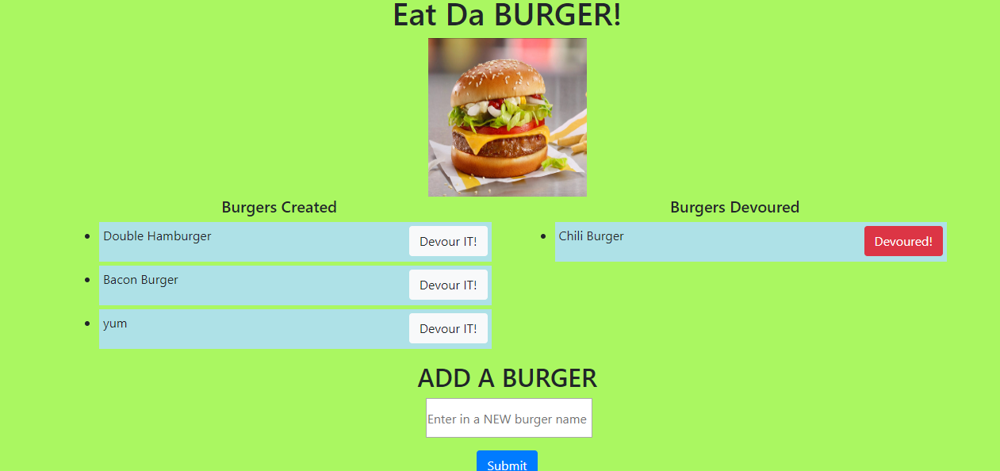
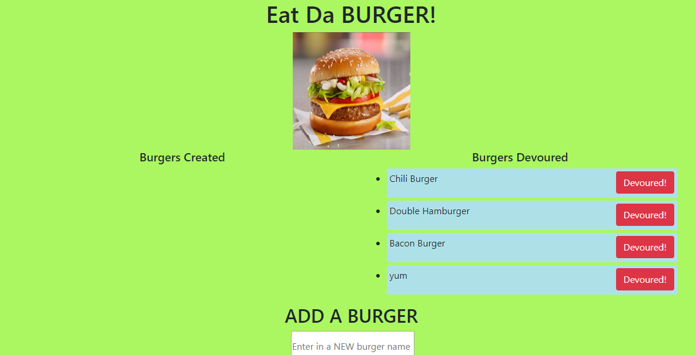

# Eat-Da-Burger

Using handlebars, mysql, and javascript I have created a burger eating app.  Simply enter in a burger of your choice and click "submit"
and the burger will be moved to the "burgers created" section.  Then you can click "devour" to get rid of the burgers that you have created.
